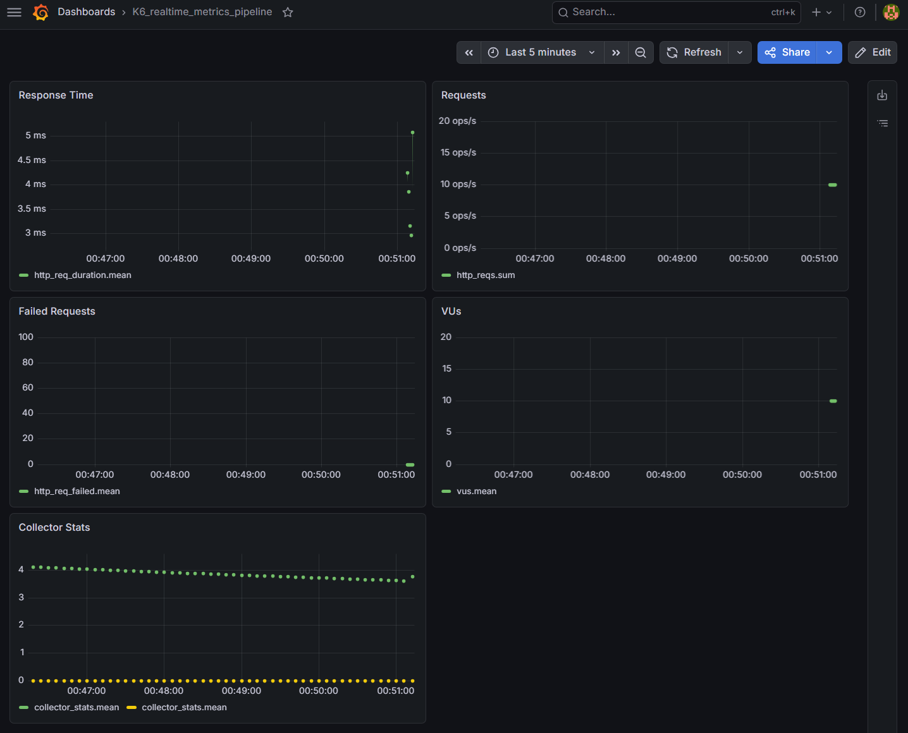

# Grafana Dashboard

## 목적

k6 → Kafka → Collector → InfluxDB v3로 수집된 메트릭을 시각화한다.

---

## Data Source 설정

```
Connections → Data sources → Add data source → InfluxDB
```

| 항목 | 값 |
| --- | --- |
| Query language | InfluxQL |
| URL | [http://influxdb:8181](http://influxdb:8181/) |
| Database | k6_metrics |

### HTTP Header

```
Authorization: Token <INFLUX_TOKEN>
```

---

## 사용 Measurement

| Measurement | 의미 |
| --- | --- |
| http_req_duration | 요청 응답 시간 |
| http_reqs | 요청 수 |
| http_req_failed | 실패 요청 |
| vus | 가상 유저 수 |
| collector_stats | Collector 내부 상태 |

---

## Dashboard Preview



---

## 패널 구성

### ⚠️ 규칙

```
패널 1개 = 메트릭 1개
```

여러 메트릭을 하나의 패널에 넣지 않는다.

### 1. Response Time

- Measurement: `http_req_duration`
- Query: `mean(value)`
- Unit: milliseconds (ms)

의미:

- API 응답 속도
- latency 분포 확인

### 2. Requests

- Measurement: `http_reqs`
- Query: `sum(value)`
- Unit: ops/sec

의미:

- 초당 처리 요청 수 (RPS)

### 3. Failed Requests

- Measurement: `http_req_failed`
- Query: `mean(value)`

의미:

- 실패율
- 정상 상태: 0 유지

### 4. VUs

- Measurement: `vus`
- Query: `mean(value)`

의미:

- 현재 부하 수준
- k6 시나리오 반영 여부 확인

### 5. Collector Stats

- Measurement: `collector_stats`
- Query:
    - `mean(tps)`
    - `mean(kafka_lag)`

의미:

- tps: Collector 처리량
- kafka_lag: Kafka 지연

정상 기준:

```
kafka_lag = 0
```

---

## 실행 및 검증 방법

### 1. k6 실행

```
./k6/run_k6_test.sh load
```

### 2. Grafana 확인

```
http://localhost:3000
```

### 3. 정상 기준

- 그래프가 실시간으로 변화
- Response Time 값 존재
- Requests 값 증가
- VUs 변화 반영
- Failed Requests = 0
- kafka_lag = 0

## 실패 기준

| 증상 | 원인 |
| --- | --- |
| 그래프 변화 없음 | datasource 설정 오류 |
| 값이 0 | Collector write 실패 |
| 일부만 표시 | Kafka 또는 parsing 문제 |

---

## 대시보드 파일

```
observability/grafana/dashboards/k6-realtime-metrics.json
```